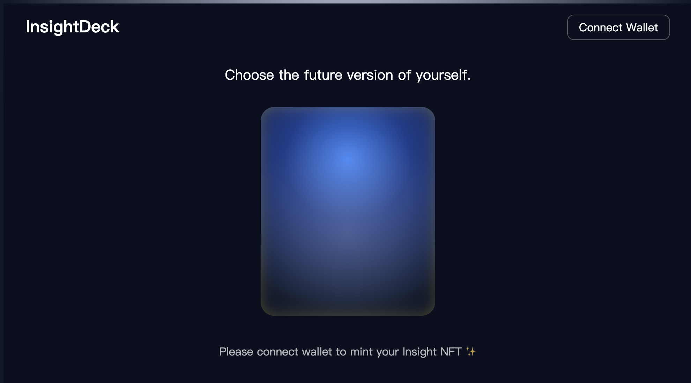

## 🔮 InsightDeck – Web3 Insight Card NFT

### 🔗 Live Demo: https://insightdeck.vercel.app/

## 🌟 Project Overview 项目简介

InsightDeck is a lightweight Web3 NFT card-drawing experience built with Solidity, React, Wagmi, and Vercel.

InsightDeck 是一个基于 Solidity、React、Wagmi 和 Vercel 的轻量 Web3 NFT 抽卡体验项目。

Users can draw a random “insight card,” flip the card with animation, and mint it as an NFT on Sepolia.

用户可以抽取一张随机的洞察卡牌，并通过翻牌动画展示，然后在 Sepolia 测试网铸造成 NFT。

Each card features a modern motivational quote stored as a PNG on IPFS.

每张卡牌包含一句现代风格的励志金句，并以 PNG 图片形式存储在 IPFS 上。

This project demonstrates wallet interaction, NFT minting, IPFS storage, and animated UI effects.

该项目展示了钱包交互、NFT 铸造、IPFS 文件存储和动画 UI 效果。

## 🎴 Features 功能特点

Draw random insight cards with flipping animation.

以抽卡式动画随机展示洞察卡牌。

Mint cards as ERC-721 NFTs on Sepolia Testnet.

将卡牌铸造成 ERC-721 NFT（Sepolia 测试网）。

100 modern motivational quotes included.

内含 100 条现代风格的励志金句。

Card PNGs stored on IPFS (Pinata gateway).

卡牌 PNG 图像存储在 IPFS（Pinata）。

Full wallet integration: Rabby / MetaMask / WalletConnect.

完整的钱包支持：Rabby / MetaMask / WalletConnect。

Deployed on Vercel with high performance and zero-config.

使用 Vercel 部署，性能稳定、零配置。

## 🛠 Tech Stack 技术栈

Frontend: React, Vite, Wagmi, CSS animations

前端： React、Vite、Wagmi、CSS 动画

Smart Contract: Solidity, Hardhat, ERC721Enumerable

智能合约： Solidity、Hardhat、ERC721Enumerable

Storage: IPFS via Pinata

存储： 使用 Pinata 的 IPFS

Deployment: Vercel

部署： Vercel

## 📸 Screenshots

## 🚀 How to Run Locally 本地运行方式

    cd frontend
    npm install
    npm run dev

## 🔨 Smart Contract Deployment 智能合约部署

Compile the contract:

编译智能合约：

    npx hardhat compile

Deploy to Sepolia:

部署到 Sepolia：

    npx hardhat run scripts/deploy.js --network sepolia

Set the base PNG directory on IPFS:

设置 IPFS 图片基础路径：

    await contract.setBaseImageURI("https://your.pinata.gateway/<CID>/");

## 🙌 Author

Created by Janna (2025).
